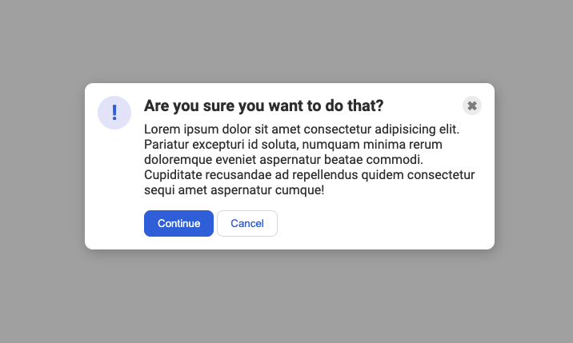

# A common 'modal' style
This one is another very common pattern on the web. The solution to this one is _simple_... but it might not be immediately obvious to you. You'll need to edit the HTML a bit to get everything where it needs to be.

### A hint
Depending on how you approach this one, you might need to revisit the `flex-shrink` property to keep a flex item from getting smashed.

## Instructions and Requirements

Do the styling work in two stages:

**Stage 1, basic styling:**
- Font: Roboto weight 400 and 700 is used
- Background color is: #aaa
- Text color is #333
- Tha modal width is 480px, the background is white, border radius is 10px and has a nice box shadow
- the .icon is 42px x 42px, font size is 1,4rem and has weight 700, font color royalblue, background: lavender, the box is circle. The ! is centerd in thet circle
- The Close button (the x on the right side): width and height 24px, font size 1rem regular weight, font color: #888, background: #eee, the box is circle. The x is centerd in thet circle
- Buttons at the bottom: has some padding and nice rounded edges
- The continue button: background color: royalblue, font color white
- The cancel button: background color: white, font color royalblue, have some border too...

**Desired basic styling outcome**

**Stage 2, final styling:**
- The modal is centered on the viewport
- The blue icon is aligned to the left.
- There is equal space on either side of the icon (the gaps between the icon and the edge of the card, and the icon and the text, are the same).
- There is padding around the edge of the modal.
- The header, text, and buttons are aligned with each other.
- The header is bold and a slightly larger text-size than the text.
- The close button is vertically aligned with the header, and aligned in the top-right of the card.

**Desired final outcome**

Idea taken from @The Odin Project